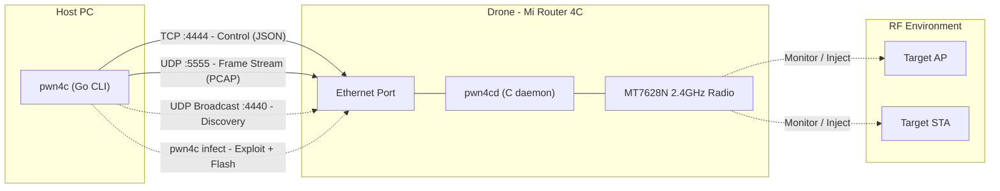
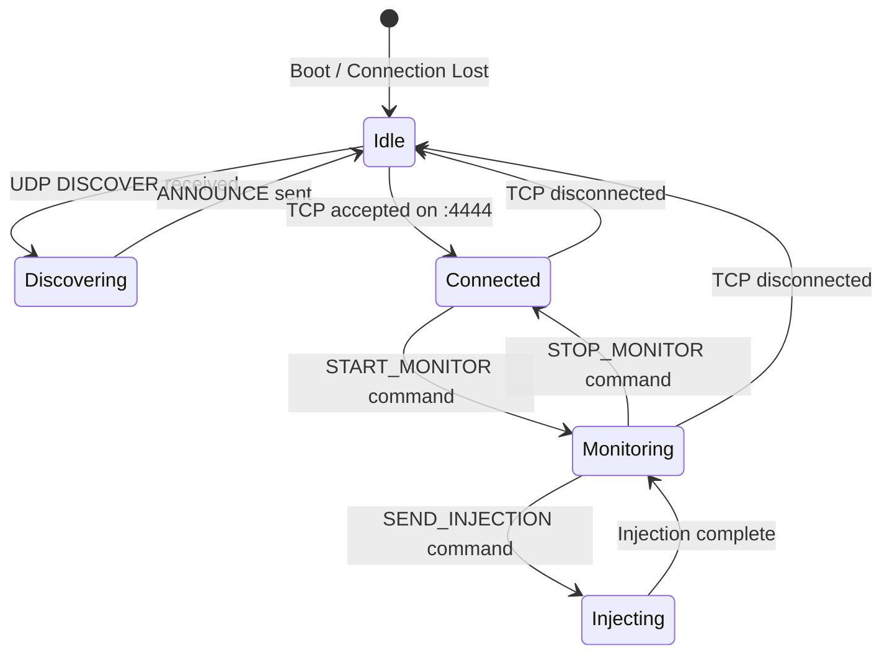

# Architecture

## System Overview

Pwn4C is a split-architecture Wi-Fi penetration testing platform. Two physical nodes connect over a direct Ethernet cable:

| Component | Role | Hardware | Software |
|-----------|------|----------|----------|
| **Drone** | Headless RF implant: captures and injects 802.11 frames | Xiaomi Mi Router 4C (MT7628N) | Custom OpenWrt rootfs + `pwn4cd` daemon |
| **Host** | Command-and-control: orchestrates attacks, stores captures, deploys firmware | Any PC with Ethernet | `pwn4c` Go CLI binary |

The Drone never touches the internet. All communication flows over a single point-to-point Ethernet cable.

---

## System Diagram



---

## Role Separation

### Drone Responsibilities

- Place the MT7628N radio into monitor mode on a specified channel.
- Capture raw 802.11 frames (with RadioTap headers) and stream them to the Host over UDP.
- Accept injection payloads from the Host and transmit them on the active channel.
- Respond to UDP autodiscovery beacons.
- Expose an emergency Dropbear SSH server on TCP port 22 for out-of-band recovery.

The Drone performs zero frame analysis. It is a dumb RF transceiver controlled entirely by the Host.

### Host Responsibilities

- Deploy firmware to a stock Xiaomi router via the automated `infect` command (see [Automated Infection Lifecycle](#automated-infection-lifecycle)).
- Discover the Drone on the local Ethernet segment via UDP broadcast.
- Issue operational commands (channel selection, monitor start/stop, injection dispatch) over TCP.
- Receive, buffer, and write PCAP captures streamed from the Drone.
- Run all attack logic, handshake analysis, and deauthentication scheduling.
- Check for firmware updates via the GitHub Releases API and orchestrate local reflashing.

---

## Automated Infection Lifecycle

The Go client includes a built-in `infect` command that converts a stock Xiaomi Mi Router 4C into a Pwn4C Drone in a single step. This leverages the OpenWRTInvasion exploit chain targeting CVE-2019-18370 and CVE-2019-18371 (command injection in the stock Xiaomi web interface).

### Exploit Flow

```
Host                                    Stock Xiaomi Router 4C
  |                                                |
  |-- 1. HTTP request to web API ---------------->|  (CVE-2019-18371: config download)
  |<------------- stok token + config ------------|
  |                                                |
  |-- 2. Inject payload via stok endpoint ------->|  (CVE-2019-18370: command injection)
  |   (enables telnet/SSH on the router)           |
  |                                                |
  |-- 3. SSH/Telnet session ---------------------->|
  |   Upload pwn4c-firmware.bin to /tmp            |
  |                                                |
  |-- 4. Execute: mtd write /tmp/pwn4c-firmware.bin OS1 -->|
  |                                                |
  |-- 5. Execute: reboot ------------------------->|
  |                                                |
  |   (Host polls for Drone on UDP :4440)          |
  |                                                |
  |<-- 6. ANNOUNCE (Drone is online) --------------|
  |                                                |
  |   [INFECTION COMPLETE]                         |
```

### Steps in Detail

1. **Credential extraction**: The client sends an HTTP request to the router's web API, exploiting CVE-2019-18371 to extract the `stok` authentication token and device configuration.
2. **Command injection**: Using the `stok` token, the client injects a shell command via CVE-2019-18370 that enables telnet or SSH access on the router.
3. **Firmware upload**: The client opens an SSH (or telnet) session and uploads the Pwn4C OpenWrt firmware binary to `/tmp` on the router.
4. **Flash write**: The client executes `mtd write /tmp/pwn4c-firmware.bin OS1` to overwrite the operating system partition. The factory calibration partition is not touched.
5. **Reboot**: The client issues `reboot`. The router boots into the Pwn4C OpenWrt image.
6. **Verification**: The client begins broadcasting UDP discovery packets on port 4440. Once the Drone responds with an `ANNOUNCE` packet, infection is confirmed.

The entire process takes 60-90 seconds on a typical network.

### Prerequisites

- The target router must be running **stock Xiaomi firmware** vulnerable to CVE-2019-18370/18371.
- The Host must be on the same LAN segment as the router (connected via Ethernet or Wi-Fi to the router's network).
- Routers with patched firmware require manual flashing via TFTP or UART (see [installation.md](installation.md#path-b-manual-build-and-advanced-installation)).

---

## Transport Specification

Pwn4C uses three distinct network paths, all bound to the direct Ethernet link between Host and Drone.

### 1. UDP Autodiscovery (Port 4440)

Zero-configuration device pairing. No static IPs required.

**Workflow:**

```
Host                                              Drone
  |                                                  |
  |--- UDP Broadcast :4440 ---- DISCOVER ---------->|
  |                                                  |
  |<-- UDP Unicast   :4440 ---- ANNOUNCE ---------- |
  |                                                  |
  |    (Host records Drone IP, proceeds to TCP)      |
```

1. The Host sends a UDP broadcast to `255.255.255.255:4440` containing a `DISCOVER` request with its protocol version.
2. `pwn4cd`, listening on `0.0.0.0:4440`, responds with a unicast `ANNOUNCE` packet containing the Drone's identity, firmware version, and capabilities.
3. The Host extracts the Drone's IP from the response source address and opens the TCP/UDP data channels.

If multiple Drones exist on the segment, the Host receives multiple `ANNOUNCE` responses and prompts the user to select one.

See [api_reference.md](api_reference.md#udp-autodiscovery-protocol) for exact packet schemas.

### 2. TCP Control Channel (Port 4444)

Reliable, ordered command/response path for all operational control.

| Property | Value |
|----------|-------|
| Transport | TCP |
| Port | 4444 |
| Framing | Newline-delimited JSON (`\n`-terminated) |
| Direction | Bidirectional (Host initiates; Drone may push async events) |
| Encoding | UTF-8 |

The Host opens a persistent TCP connection to `<drone_ip>:4444`. Each message is a single JSON object terminated by `\n` (0x0A). No raw binary on this channel.

**Message categories:**

| Category | Direction | Examples |
|----------|-----------|----------|
| Command | Host -> Drone | `START_MONITOR`, `SET_CHANNEL`, `SEND_INJECTION` |
| Response | Drone -> Host | Synchronous result for each command |
| Event | Drone -> Host | Asynchronous status pushes (`LINK_DOWN`, `BUFFER_OVERFLOW`) |

Commands are serialized: the Host waits for a response before sending the next command. Events may arrive between command/response pairs.

See [api_reference.md](api_reference.md#tcp-control-protocol) for the full command catalog.

### 3. UDP Frame Stream (Port 5555)

High-throughput, low-latency path for raw 802.11 frame delivery.

| Property | Value |
|----------|-------|
| Transport | UDP |
| Port | 5555 |
| Direction | Drone -> Host (unidirectional) |
| Payload | Raw frame prefixed with a fixed 16-byte stream header |
| MTU | Frames exceeding Ethernet MTU (1500 bytes) are fragmented at the stream layer |

Once `START_MONITOR` succeeds, the Drone streams captured frames to `<host_ip>:5555`. Each UDP datagram contains:

```
+------------------+-------------------------------+
| Stream Header    | RadioTap Header + 802.11 Frame|
| (16 bytes)       | (variable length)             |
+------------------+-------------------------------+
```

The stream header carries a 32-bit sequence number, 32-bit timestamp (microseconds since monitor start), 16-bit fragment info, and 16-bit frame length. The Host uses sequence numbers to detect dropped frames.

UDP is chosen intentionally: TCP head-of-line blocking on a busy RF channel introduces unacceptable latency and backpressure stalls.

See [api_reference.md](api_reference.md#udp-frame-stream-format) for byte-level layout.

---

## `pwn4cd` Daemon Architecture

`pwn4cd` is a single-threaded, event-driven C binary cross-compiled for `mips_24kc` with `musl` libc. Zero runtime dependencies beyond the kernel and libc.

### Internal Structure

```
┌─────────────────────────────────────────────────────┐
│                     pwn4cd                          │
│                                                     │
│  ┌──────────────┐  ┌──────────────┐  ┌───────────┐ │
│  │ Discovery    │  │ Control      │  │ Frame     │ │
│  │ Listener     │  │ Handler      │  │ Streamer  │ │
│  │ (UDP :4440)  │  │ (TCP :4444)  │  │ (UDP :5555)│ │
│  └──────┬───────┘  └──────┬───────┘  └─────┬─────┘ │
│         │                 │                │        │
│         └────────┬────────┘                │        │
│                  │                         │        │
│          ┌───────▼────────┐        ┌───────▼──────┐ │
│          │  Command       │        │  Capture     │ │
│          │  Executor      │        │  Ring Buffer │ │
│          │                │        │  (64KB)      │ │
│          └───────┬────────┘        └───────┬──────┘ │
│                  │                         │        │
│          ┌───────▼─────────────────────────▼──────┐ │
│          │         Wireless Interface Manager     │ │
│          │  (netlink / iw / iwconfig wrappers)    │ │
│          └────────────────────────────────────────┘ │
└─────────────────────────────────────────────────────┘
                         │
                    ┌────▼────┐
                    │ MT7628N │
                    │ Radio   │
                    └─────────┘
```

### Subsystem Details

**Discovery Listener**: Binds `SOCK_DGRAM` on `0.0.0.0:4440`. Parses incoming `DISCOVER` JSON payloads, validates version compatibility, replies with `ANNOUNCE`. Stateless.

**Control Handler**: Binds `SOCK_STREAM` on `0.0.0.0:4444`. Accepts exactly one TCP connection at a time (subsequent connections are refused). Reads newline-delimited JSON commands, dispatches to the Command Executor, writes back responses. If the connection drops, monitor mode and injection halt, and the daemon returns to idle.

**Command Executor**: Translates abstract commands into concrete wireless interface operations. `START_MONITOR` configures the `ra0` interface into monitor mode via `iw`. `SET_CHANNEL` issues a channel-switch command. `SEND_INJECTION` opens a raw packet socket and transmits the provided frame bytes. All operations are synchronous.

**Capture Ring Buffer**: Fixed 64KB circular buffer in user-space. The wireless interface (in monitor mode) delivers frames via a raw socket. The ring buffer absorbs burst traffic and feeds the Frame Streamer. When full, oldest frames are silently dropped and a `BUFFER_OVERFLOW` event is pushed to the control channel.

**Frame Streamer**: Reads frames from the ring buffer, prepends the 16-byte stream header, sends UDP datagrams to the Host's IP (learned from the TCP connection's peer address). Fragmentation logic splits frames exceeding 1472 bytes (1500 MTU minus 20 IP minus 8 UDP overhead).

**Wireless Interface Manager**: Abstraction layer over `iw` and `ip link`. Manages monitor mode transitions, channel switching, TX power, and MAC randomization. Wraps `system()` calls with 2-second timeout enforcement to prevent daemon hangs from unresponsive drivers.

### Lifecycle



On boot, `pwn4cd` starts as an `init.d` service (`/etc/init.d/pwn4cd`), binds its sockets, and enters the Idle state.

### Build and Cross-Compilation

`pwn4cd` is compiled with the OpenWrt SDK toolchain:

```
Target:     mips_24kc
Libc:       musl
Compiler:   mipsel-openwrt-linux-musl-gcc
CFLAGS:     -Os -s -ffunction-sections -fdata-sections
LDFLAGS:    -Wl,--gc-sections -static
Binary size: ~48KB stripped
```

The resulting static binary is embedded directly into the OpenWrt rootfs image during the firmware build.
